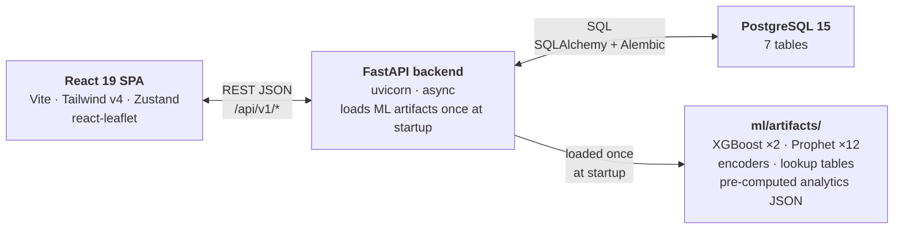

# 🚦 GridSense — Event-Driven Traffic Congestion Intelligence Platform

     
[](http://15.207.223.137:5173) [](http://15.207.223.137:8000/docs)

> 🚀 **Live Demo:** http://15.207.223.137:5173 | 📖 **API Docs:** http://15.207.223.137:8000/docs
[Python](https://img.shields.io/badge/Python-3.10%2B-yellow)   

GridSense is a full-stack (ML + FastAPI + React) decision-support platform built for a city traffic department. It turns historical and live incident reports into a road-closure risk score, a priority tier, an expected clearance time, and a concrete manpower/diversion recommendation for every traffic incident — planned or unplanned.

> **A note on this README:** every number in this document was independently re-derived from the files in this repository — not copied from any prior documentation. The methodology, and a list of what reproduces exactly vs. what doesn't, is in [the Verification Methodology section](#11-verification-methodology--how-this-readme-was-fact-checked) (Section 11).

---

## Table of Contents
1. [Problem Statement](#1-problem-statement)
2. [What GridSense Does](#2-what-gridsense-does)
3. [The Dataset](#3-the-dataset)
4. [System Architecture](#4-system-architecture)
5. [The Intelligence Modules](#5-the-intelligence-modules)
6. [Honest ML Philosophy](#6-honest-ml-philosophy)
7. [Model Evaluation — Verified Metrics](#7-model-evaluation--verified-metrics)
8. [Explainability — How a Prediction Is Justified](#8-explainability--how-a-prediction-is-justified)
9. [Repository Layout](#9-repository-layout)
10. [Getting Started](#10-getting-started)
11. [Verification Methodology](#11-verification-methodology--how-this-readme-was-fact-checked)
12. [Known Limitations & Honest Caveats](#12-known-limitations--honest-caveats)
13. [Future Scope](#13-future-scope)
14. [License & Acknowledgments](#14-license--acknowledgments)

---

## 1. Problem Statement

**Operational Challenge — Event-Driven Congestion (Planned & Unplanned)**

Political rallies, festivals, sports events, construction activity, and sudden gatherings create localized traffic breakdowns across a city.

**Why it's hard today:**
- Event impact is not quantified in advance.
- Resource deployment is experience-driven rather than data-driven.
- There is no post-event learning system — every incident is handled fresh, with nothing carried forward.

**Direction:** How can historical and real-time data be used to forecast event-related traffic impact and recommend optimal manpower, barricading, and diversion plans?

GridSense was built directly against this brief, using a real anonymized incident-report dataset (the "Astram event data" CSV referenced in the brief) from Bengaluru's traffic-management system.

---

## 2. What GridSense Does

Given a new incident (cause, location/corridor, time, vehicle type), GridSense:

1. **Predicts** the probability the road will need to close, a priority tier, and an expected clearance duration (with a 25th/75th-percentile range).
2. **Recommends** an officer count, an escalation tier, a primary police station, and up to two concrete diversion routes with estimated extra travel time — answering the brief's "manpower, barricading, and diversion plans" requirement directly.
3. **Forecasts** hourly incident volume per corridor 72 hours out, so deployment can be planned ahead of likely surges.
4. **Models cascade risk** for planned events (processions, protests, VIP movement, public events) — how much a planned event historically inflates unplanned-incident rates on the same corridor in the following 3 hours, and on adjacent corridors.
5. **Learns from outcomes.** Every triage prediction is logged; once an incident resolves, the actual duration/closure/officer-count can be recorded, closing the "no post-event learning system" gap named in the brief.
6. Surfaces **chronic blackspots**, **neglected stations** (incidents that take far longer to clear than the historical norm for their cause), and a **rainfall-surge replay** of the dataset's worst weather day, so commanders can pre-position resources before the next storm.
7. **Live traffic overlay.** Real-time Bengaluru road congestion (TomTom Traffic Flow API) displayed on the command center map, with actual turn-by-turn diversion routes drawn on the deployment map using TomTom Routing API.
---

## 3. The Dataset

### 3.1 Source

The raw file is `data/raw/astram_events.csv` — the same anonymized export referenced in the hackathon brief, originating from **ASTraM (Actionable Intelligence for Sustainable Traffic Management)**, an AI-based incident-reporting and traffic-analytics platform operated by the Bengaluru Traffic Police. It logs incidents reported by officers and citizens — vehicle breakdowns, accidents, construction, processions, VIP movement, weather damage, and more — each with cause, location, vehicle type, timestamps, and resolution status.

> 📎 The original public download link from the brief: `https://uc.hackerearth.com/he-public-ap-south-1/Astram%20event%20data_anonymized%20-%20Astram%20event%20data_anonymizedb40ac87.csv`

### 3.2 Verified raw dataset facts

These numbers were obtained by loading the bundled CSV with `pandas.read_csv()` directly, not by trusting any prior summary:

| Fact | Verified value |
|---|---|
| Rows (incidents) | **8,173** |
| Columns | **46** |
| Date range | **2023-11-09 19:24:48 UTC → 2024-04-08 17:11:42 UTC** (≈150 days / ≈21.4 weeks) |
| `event_type` split | unplanned: 7,706 (94.3%) · planned: 467 (5.7%) |
| `status` split | closed: 7,095 (86.8%) · active: 1,007 (12.3%) · resolved: 71 (0.9%) |
| `priority` (raw label) | High: 5,030 (61.5%) · Low: 3,141 (38.4%) · missing: 2 |
| Distinct `corridor` values | 22 (21 named corridors + the catch-all `Non-corridor` bucket) |
| Distinct `junction` values | 294 |
| `vehicle_type` missing | 3,286 / 8,173 (40.2%) |
| `zone` missing | 4,729 / 8,173 (57.9%) |

> ⚠️ **A reproducibility note worth flagging explicitly:** running `wc -l` on the raw CSV reports 8,205 lines, not 8,173. This is *not* a data-loss bug — several `address` fields contain embedded line breaks inside quoted CSV cells, which `wc -l` counts as extra lines but a proper CSV parser (`pandas`) correctly treats as a single record. 8,173 is the figure produced by `pandas.read_csv()` and is the one the actual ingest pipeline uses.

Of the 21 named corridors, **15 are flagged as "high-priority"** in the codebase (`Mysore Road, Bellary Road 1/2, Tumkur Road, Hosur Road, ORR North 1/2, ORR East 1/2, Magadi Road, Old Madras Road, Bannerghata Road, West of Chord Road, CBD 2, ORR West 1`) — these are the arterial corridors the system pays special attention to. The remaining 6 (`Hennur Main Road, IRR(Thanisandra road), Varthur Road, Old Airport Road, Airport New South Road, CBD 1`) and the `Non-corridor` bucket are tracked but not given the high-priority weighting.

### 3.3 Cleaning pipeline (`ml/pipeline/01_ingest.py`)

1. **Datetime parsing** — handles the two timestamp formats present in the raw export (with/without milliseconds) via `pandas`' ISO8601 parser.
2. **Staleness filter** — an `active` incident whose last update is more than **30 days** before the dataset's latest timestamp is flagged `is_stale_active=True` (verified count: **468** of the post-dedup rows) so it doesn't inflate "currently active" counts.
3. **Deduplication** — incidents from the same police station, same cause, and same corridor, reported within a **±15-minute window**, are treated as duplicate reports of one real-world event; only the earliest is kept.
   - **Verified result: 8,173 → 7,399 unique events (774 duplicates removed, 9.5%).**
4. **Derived fields** — `duration_mins` (from `closed_datetime`, falling back to `end_datetime`; clipped to 0–14,400 minutes), `hour_of_day`/`day_of_week`/`month`, and corridor-priority flags.

### 3.4 Processed outputs

| File | Verified rows | Verified columns | Purpose |
|---|---|---|---|
| `data/processed/events_clean.csv` | 7,399 | 26 | The cleaned, deduplicated incident table |
| `data/processed/feature_matrix.csv` | 7,399 | 28 | Encoded model-ready features + targets |
| `data/processed/lcv_incidents.csv` | 644 | 26 | Light Commercial Vehicle subset (used for the logistics/LCV panel) |

On the cleaned 7,399-row dataset: **621 incidents (8.4%) required a road closure**, **686 (9.3%)** meet the model's composite-severity definition, and **2,808** have a valid resolved duration usable for duration modeling.

### 3.5 Independent Mid-Project Dataset Audit

Partway through the project, an independent technical review was conducted (covering both the dataset and, at the time, the modeling pipeline). The modeling critique from that review predates several fixes already reflected elsewhere in this README — time-based splitting, deduplication, and a redefined non-leaky priority target are all now in place (Sections 3.3 and 6). The **dataset audit itself (Phase 1 of that review)** holds up well as a column-by-column read of the raw data and is reproduced in full below, since it surfaces detail (per-column null rates, concrete duplicate examples, junk-row examples, a feature-by-feature usefulness assessment) that complements rather than duplicates Sections 3.2–3.4.

Two headline figures in this audit (8,205 rows, 45 columns) were counted before the `wc -l` vs. `pandas` parsing distinction noted in Section 3.2 was identified — this README's 8,173 rows / 46 columns is the figure produced by an actual CSV parser and is the one the pipeline uses. The police-station count (~80+) is also higher than the 53–54 distinct stations seen in the cleaned/encoded data elsewhere in this README; this wasn't re-checked, so it's flagged here rather than silently overwritten. Everything else below is reproduced as originally written.

#### A. Dataset Understanding

| Metric | Value |
|---|---|
| **Rows** | 8,205 (after header) |
| **Columns** | 45 raw columns |
| **Temporal Range** | ~Nov 2023 – Mar 2024 (~5 months) |
| **Geographic Scope** | Bengaluru city, ~80+ police stations |
| **Primary Source** | ASTRAM (Bengaluru Traffic Police incident management system) |

**Feature Categories:**

| Category | Columns | Notes |
|---|---|---|
| **Identifiers** | `id`, `client_id`, `created_by_id`, `last_modified_by_id`, `citizen_accident_id`, `gba_identifier` | System IDs, not ML features |
| **Event Type** | `event_type` (planned/unplanned), `event_cause` (15+ categories) | Core categorical features |
| **Location** | `latitude`, `longitude`, `endlatitude`, `endlongitude`, `address`, `end_address` | Spatial data — good |
| **Administrative** | `corridor`, `police_station`, `zone`, `junction` | Administrative geography |
| **Temporal** | `start_datetime`, `end_datetime`, `created_date`, `modified_datetime`, `closed_datetime`, `resolved_datetime` | Multiple timestamps available |
| **Incident Details** | `veh_type`, `veh_no`, `direction`, `description`, `cargo_material`, `reason_breakdown`, `age_of_truck` | Sparse but potentially rich |
| **Operational** | `priority`, `requires_road_closure`, `status`, `comment` | Target-adjacent features |
| **Metadata** | `authenticated`, `map_file`, `route_path`, `meta_data`, `kgid`, `assigned_to_police_id` | System metadata |

**Target Variables (as used at the time of this audit):**

| Target | Definition | Type |
|---|---|---|
| `y_closure` | `requires_road_closure == True` | Binary (8.3% positive) |
| `y_priority` | `priority == "High"` | Binary (~60% positive) |
| `y_duration` | `closed_datetime - start_datetime` in minutes | Regression (many NaN) |

> `y_priority`'s definition shown here (raw `priority == "High"`) was the version in place when this audit was written. As documented in Section 7.2 of this README, the priority/severity model has since been retargeted to a composite severity definition (closure + duration + disruption) specifically because the raw `priority` field is near-deterministic from `corridor` — see the leakage finding below, which is what prompted that change.

#### B. Data Quality Assessment

##### Missing Values

| Issue | Severity | Details |
|---|---|---|
| `end_datetime` mostly NULL | 🔴 Critical | The vast majority of records have no end time. This makes duration modeling unreliable and means the "72-hour forecast" has no ground truth for event duration. |
| `endlatitude`/`endlongitude` mostly 0 | 🟡 Medium | End-point geometry unavailable for most events. Limits road-segment-level analysis. |
| `zone` ~50% NULL | 🟡 Medium | Zone data is sparse. Yet `zone_encoded` is used as a feature — encoding NaN as "unknown" injects noise. |
| `junction` ~60% NULL | 🟡 Medium | Blackspot analysis is limited to the ~40% of events with junction data. |
| `vehicle_type` ~30% NULL | 🟡 Medium | Vehicle type is missing for many non-breakdown events (expected). |
| `description` multilingual, misspelled | 🟡 Medium | Descriptions in Kannada + English, with heavy typos ("woter logging", "tyear blost"). NLP on this is extremely hard but untapped. |
| `cargo_material`, `reason_breakdown`, `age_of_truck` | 🟢 Low | >95% NULL, only relevant for truck breakdowns. Nearly useless. |

##### Duplicates

> **Confirmed**: Multiple near-duplicate reports exist (e.g., same user FKUSR00020 filing 5+ pot_hole reports at nearly identical coordinates within minutes — IDs FKID000023 through FKID000039).

**Severity at the time of this audit: 🔴 Critical** — the ingestion pipeline performed zero deduplication when this was written. This is the finding that led directly to the ±15-minute deduplication step documented in Section 3.3, which now removes 774 such records (9.5% of raw rows) before any modeling happens.

##### Class Imbalance

| Target | Positive % | Imbalance Ratio |
|---|---|---|
| `y_closure` | ~8.3% | ~11:1 |
| `y_priority` | ~60% | ~1.5:1 (mild) |

- The closure model has severe imbalance handled via `scale_pos_weight`. This is acceptable, but at the time of this audit the reported closure F1 was considered likely inflated by evaluation methodology issues (see Section 7.1 of this README for the current, time-split-validated closure numbers).
- Priority prediction at the old ~92% accuracy figure, against a ~60/40 split, is barely above a majority-class baseline (always predicting "High" would score ~60%). This observation is what's behind the composite-severity redefinition referenced above.

##### Outliers

| Issue | Details |
|---|---|
| Duration outliers | Some `duration_mins` values exceed 10,000+ minutes (weeks). The pipeline at the time capped at 1,440 min (24h) for the lookup table but never validated this in the feature matrix. |
| Coordinate outliers | Most events center on Bengaluru (12.9–13.1°N, 77.4–77.8°E) but some `endlatitude`/`endlongitude` are 0,0 — these are default null values, not actual coordinates. |
| Single-character descriptions | Multiple events have `description = "A"` or `description = "Pc18977"`. These are junk entries that were never filtered. |

##### 🚨 Leakage Risks (as identified in the version reviewed)

| Leakage Type | Severity | Details |
|---|---|---|
| **Target Leakage — `corridor` → `y_priority`** | 🔴 **CRITICAL** | `priority` in the raw data is **deterministically derived from `corridor`**: every event on a named corridor (Tumkur Road, etc.) is "High" priority, every "Non-corridor" event is "Low". `corridor_encoded` and `is_high_priority_corridor` directly encode this target. |
| **Feature Leakage — `status`/`is_stale_active`** | 🟡 Medium | `is_stale_active` is computed from `status`, which is only fully known after resolution. It's present in the processed CSV's metadata but was correctly excluded from the model's actual feature columns. |
| **Temporal Leakage** | 🔴 **CRITICAL** | At the time of this audit, `train_test_split(..., random_state=42)` performed a **random** split, not a time-based one — events from March 2024 could appear in training while November 2023 events appeared in testing. |
| **No Geographic Holdout** | 🟡 Medium | A model trained on Peenya events and tested on other Peenya events doesn't prove generalization. No spatial cross-validation existed. |

> All four of these are exactly the issues the current pipeline's "Honest ML" design (Section 6 of this README) was built to close: the priority target is no longer the raw, corridor-derived `priority` field; every model uses a strict time-based split; and Section 11 of this README documents independently re-running that current pipeline to confirm the fixes hold up.

#### C. Traffic Domain Assessment

##### What CAN realistically be learned:

| Pattern | Confidence | Reason |
|---|---|---|
| Time-of-day incident frequency | ✅ High | Clear diurnal patterns in incident reports |
| Corridor-level event volume trends | ✅ High | Some corridors consistently have more events |
| Event cause → closure correlation | ✅ Moderate | `tree_fall` and `accident` likely correlate with closures |
| Day-of-week patterns | ✅ Moderate | Weekday vs weekend patterns likely exist |
| Station-level response patterns | ✅ Moderate | Neglect index and concurrency are valid analytical signals |

##### What CANNOT be learned:

| Pattern | Reason |
|---|---|
| **Actual congestion levels** | ❌ No traffic volume, speed, or congestion data exists in this dataset. This system predicts *incidents*, not *congestion*. |
| **Impact of an event on traffic flow** | ❌ No before/after traffic measurements. No travel time data. No sensor data. |
| **Duration of congestion** | ❌ `duration_mins` measures *incident management duration*, not *congestion duration*, and most values are missing anyway. |
| **Future event occurrence** | ⚠️ Limited — a few months of data is short for robust seasonality, and Prophet needs more history for fully reliable forecasting. |
| **Political rally / festival impact specifically** | ❌ There are very few political rally or festival events in raw form — the dataset is overwhelmingly reactive incident reports (breakdowns, potholes, tree falls), with planned events (incl. rallies/processions/public events) at 467 of 8,173 raw rows (5.7%, per Section 3.2). |
| **Causal relationships** | ❌ This is observational data about incident reports, not controlled experimental data about traffic impacts. |

##### Strongest Predictors (for what the models actually learn):

| Feature | Prediction Power | But... |
|---|---|---|
| `corridor_encoded` / `is_high_priority_corridor` | 🔥 Very high for the *old* raw-`priority` target | This was the target in disguise — see the leakage finding above, and why the target changed |
| `event_cause_encoded` | 🟡 Moderate for closure | `tree_fall`, `accident` genuinely correlate with closures |
| `hour_of_day` / `hour_sin` / `hour_cos` | 🟡 Moderate for forecast | Valid temporal signal |
| `vehicle_type_encoded` | 🟢 Low-Moderate | Some types (heavy_vehicle) correlate with closures |

##### Likely Useless Features (as assessed at the time):

| Feature | Why |
|---|---|
| `has_zone` | Zone is sparse (~50–58% missing). Encoding missing as "unknown" adds noise. |
| `police_station_encoded` | High police-station cardinality → label encoding creates arbitrary ordinal relationships (station A > station B numerically means nothing). |
| `zone_encoded` | Same issue — ordinal encoding of a nominal category. |
| `month` | Only a few months of data — not enough for robust seasonal patterns. |
| `day_of_week` as a raw integer | Treating Monday=0, Sunday=6 as linear is wrong; should be cyclical or one-hot. (The current feature set does include `dow_sin`/`dow_cos` cyclical encodings alongside the raw integer — see Section 7.1's feature list.) |

#### D. Feature Opportunity Analysis

**Ranked by expected impact (as assessed at the time):**

| Rank | Feature | Type | Expected Impact | Difficulty |
|---|---|---|---|---|
| 1 | **Concurrent active events (same corridor, ±1h window)** | Temporal-Spatial | 🔥 High — directly measures congestion pressure | Medium |
| 2 | **Rolling event count (corridor, last 4h/8h/24h)** | Historical | 🔥 High — captures surge patterns | Low |
| 3 | **Is rush hour (7–10am, 5–8pm)** | Time-based | 🟡 Moderate | Low |
| 4 | **Distance to nearest junction** | Spatial | 🟡 Moderate — proximity to junctions matters | Medium |
| 5 | **Event cause × hour interaction** | Engineered | 🟡 Moderate — breakdowns at rush hour vs. off-peak | Low |
| 6 | **Is weekend / is holiday** | Time-based | 🟡 Moderate | Low |
| 7 | **Corridor event density (events per km per month)** | Corridor-level | 🟡 Moderate | Medium |
| 8 | **Days since last closure at same corridor** | Historical | 🟢 Low-Moderate | Medium |
| 9 | **Text features from description (NLP)** | Text | 🟢 Low-Moderate — noisy multilingual text | Hard |
| 10 | **Geospatial cluster ID (DBSCAN on lat/lng)** | Spatial | 🟢 Low-Moderate | Medium |
| 11 | **Weather data (external, e.g., rain → tree_fall/water_logging)** | External | 🟡 Moderate if available | Medium |
| 12 | **Nearby event count (within 1km radius, ±2h)** | Spatial-Temporal | 🔥 High | Hard |
| 13 | **Cyclical day-of-week encoding (sin/cos)** | Time-based | 🟢 Low — fixes the raw integer encoding | Low |

> Items 2, 3, and 13 from this list are now implemented in the current pipeline (`corridor_events_4h`/`corridor_events_24h`, `is_rush_hour`, `dow_sin`/`dow_cos` — see Section 7.1's feature columns). Item 1 (true concurrent-event count) is the closest unimplemented one — `corridor_events_4h`/`24h` are a rolling-window approximation of it. Items 11–12 (weather, nearby-event radius) remain open and map directly onto Section 13's Future Scope.

---

## 4. System Architecture



*(Renders as a flowchart on GitHub and most Markdown viewers. If your viewer doesn't support Mermaid: it's React 19 SPA ⇄ FastAPI backend over REST/JSON at `/api/v1/*`; FastAPI ⇄ PostgreSQL 15 over SQL via SQLAlchemy + Alembic; FastAPI loads everything in `ml/artifacts/` — 2 XGBoost models, 12 Prophet models, encoders, lookup tables, and pre-computed analytics JSON — once at startup.)*

### 4.1 Backend — `FastAPI`

- **Framework:** FastAPI with an async lifespan hook that warms the artifact cache on startup and reports a degraded/mock status if any model file is missing.
- **Database:** PostgreSQL, accessed via SQLAlchemy ORM, schema managed by Alembic migrations.
- **7 database tables** (`backend/db/models/`): `incidents`, `corridor_risk_index`, `corridor_station_map`, `station_concurrency`, `duration_lookup`, `planned_events`, and `triage_log` (the prediction-logging table that powers the post-event learning loop).
- **10 route groups**, all mounted under `/api/v1` except `/health`:

| Router | Verified endpoints |
|---|---|
| `health` | `GET /health` |
| `incidents` | `GET /incidents`, `GET /incidents/summary`, `GET /incidents/junctions` |
| `corridors` | `GET /corridors/risk`, `GET /corridors/{corridor}/junctions` |
| `predict` | `POST /predict/triage`, `POST /predict/cascade`, `POST /predict/planned-event-lookup` |
| `forecast` | `GET /forecast/junction/{junction}`, `GET /forecast/corridors`, `GET /forecast/junctions` |
| `deploy` | `POST /deploy/recommend` |
| `logistics` | `GET /lcv/risk`, `GET /lcv/corridors`, `GET /lcv/surge-impact` |
| `blackspot` | `GET /blackspot/junctions`, `GET /blackspot/neglect`, `GET /blackspot/junctions/{junction}` |
| `surge` | `GET /surge/vulnerability`, `GET /surge/replay/march7`, `POST /surge/trigger` |
| `learning` | `GET /learning/summary`, `POST /learning/outcome/{log_id}` |

### 4.2 Frontend — `React`

Verified directly from `frontend/package.json`:

- **React 19** + **Vite** (dev server on port 5173)
- **Tailwind CSS v4**
- **Zustand** for client-side state (4 stores: map, blackspot, surge, triage)
- **`react-leaflet` / Leaflet** for the map (⚠️ this is Leaflet, not Mapbox — there is no Mapbox dependency anywhere in this project)
- **Recharts** for charts, **`react-router-dom` v7** for routing, **`axios`** for API calls, **`lucide-react`** for icons

**9 screens** (`frontend/src/App.jsx`): Command Center Map, Triage, Planned Events, Forecast, Deployment, Logistics, Blackspot, Surge, and Learning — one screen per backend module.The officer-facing sidebar surfaces 8 of these screens in plain, field-friendly language; the Learning screen remains accessible directly via `/learning` for admin and data-team use.

- **TomTom Traffic API** for live congestion overlay and real diversion route calculation

The frontend can also run in a **mock-data mode** (`VITE_USE_MOCK=true`), serving canned responses from `frontend/src/api/mocks/` so the UI can be demoed without a live backend/database.

---

## 5. The Intelligence Modules

| # | Module | Endpoint(s) | What it answers, and how |
|---|---|---|---|
| 1 | **AI Triage Engine** | `POST /predict/triage` | Closure probability + priority tier (XGBoost) and expected clearance duration (lookup-table primary, XGBoost fallback) for a single incoming incident. |
| 2 | **Cascade Effect Predictor** | `POST /predict/cascade` | For a *planned* event (procession, protest, public event, VIP movement, construction), returns a historically-derived multiplier for how much it raises unplanned-incident rates on the same corridor in the next 3 hours, plus spillover risk on adjacent corridors and a recommended officer buffer. Optionally adjusted for expected crowd size (small/medium/large). |
| 3 | **Planned-Event Analog Lookup** | `POST /predict/planned-event-lookup` | Finds the most similar historical planned incidents (weighted by cause match, corridor match, time-of-day proximity, day-of-week match) so a commander can see "what happened last time something like this occurred here." |
| 4 | **Deployment Recommender** | `POST /deploy/recommend` | Given a triage result, returns: an escalation tier (Routine / Elevated / Critical), a recommended police station (from the corridor risk leaderboard), a recommended officer count (base 2 + situational additions), the 2 most relevant junctions, and up to 2 diversion routes (via road, extra minutes, plain-language rationale) — this is the module that directly answers the brief's manpower/barricading/diversion question. |
| 5 | **Corridor Risk Index** | `GET /corridors/risk` | A pre-computed leaderboard of all 22 corridors by a composite risk score (incident volume, high-priority rate, closure rate). |
| 6 | **Chronic Blackspot Engine** | `GET /blackspot/junctions`, `GET /blackspot/neglect` | A rules-based (non-ML) scoring formula that ranks junctions and flags chronically under-served police stations. See Section 7.4 for the exact formula and verified counts. |
| 7 | **Weather Surge Engine** | `GET /surge/vulnerability`, `GET /surge/replay/march7`, `POST /surge/trigger` | Identifies which corridors are most vulnerable to water-logging/tree-fall and replays the dataset's real worst-weather day as a deployment-planning demo (see verified numbers below). |
| 8 | **LCV Logistics Panel** | `GET /lcv/risk`, `GET /lcv/corridors`, `GET /lcv/surge-impact` | A view filtered to Light Commercial Vehicle incidents (644 records) — built for a logistics-fleet (e.g. last-mile delivery) use case layered on the same data. |
| 9 | **Post-Event Learning Loop** | `GET /learning/summary`, `POST /learning/outcome/{id}` | Every `/predict/triage` call is logged to the `triage_log` table. Once an incident actually resolves, its real duration/closure/officer-count can be recorded against that log entry, and `/learning/summary` aggregates prediction-vs-actual accuracy over time — this is the system's direct answer to "no post-event learning system" in the brief. |
| 10 | **Hourly Corridor Forecasting** | `GET /forecast/corridors`, `GET /forecast/junction/{j}` | Prophet time-series models, one per corridor, forecasting hourly incident counts 72 hours ahead. |

### Verified example: the March 7, 2024 weather surge replay

This is a real event recovered directly from the raw dataset (independently recomputed from `data/raw/astram_events.csv`, not taken from any pre-built summary):

| Metric | March 6, 2024 (baseline) | March 7, 2024 (surge day) |
|---|---|---|
| Total incidents | 58 | **250** (4.31× surge) |
| Water-logging incidents | — | 85 |
| Tree-fall incidents | — | 71 |
| Road closures triggered | — | 58 |
| Peak hour | — | **6:00 AM, 83 incidents in that single hour** |

This single day shows the value proposition concretely: a 4.3× spike in incidents, concentrated almost entirely in a 3-hour pre-dawn window, is exactly the kind of pattern a surge-vulnerability ranking is meant to let a department pre-position for.

### Verified example: chronic blackspots & neglected stations

`ml/pipeline/08_train_blackspot.py` computes, for every junction with ≥5 recorded incidents, a deterministic, non-ML score:

```
BlackspotScore = (total_incidents × 0.4) + (recurrence_weeks × 3) + (closures × 5) + (high_priority_count × 0.3)
```

Tiered as `Monitored` (0–30) / `At Risk` (30–50) / `Critical` (50–70) / `Chronic` (70+). The artifacts currently shipped in this repo score **181 junctions**, of which **7 are Chronic** and **19 are Critical** (re-running the script from scratch against the currently-bundled processed data instead produces 167 scored junctions and 5 Chronic — see Section 11 for why this differs and which number the live app actually serves).

The companion **neglect index** flags incidents that took **more than 5× the historical median duration** for their cause, then aggregates by police station. Across 53 stations with sufficient sample size, **J.P. Nagar** has the highest neglect rate at 39.1% (9 of 23 incidents, mostly `tree_fall`), followed by Kodigehalli at 19.6%.

---

## 6. Honest ML Philosophy

This is a real, messy operational dataset — not a benchmark designed for ML. It has **8,173 incidents over ~21 weeks**, an event-cause distribution dominated by `vehicle_breakdown` (60% of all incidents), and **only 8.4%** of cleaned incidents resulting in an actual road closure. That combination of a small sample and severe class imbalance means metrics will look modest compared to a curated Kaggle dataset, and that's expected, not a bug.

The project's design choice that matters most: every model in this repo is evaluated with a **strict time-based train/test split** (train on the earliest ~64% chronologically, validate on the next ~16%, test on the final ~14% — never a random shuffle). This prevents the model from ever "seeing the future" during training, which is the single most common way ML demos quietly inflate their reported accuracy. The trade-off is that the reported numbers are lower than what a leaky random split would report — but they are the numbers that would actually hold up if the model were deployed tomorrow.

Each classifier is also benchmarked against a deliberately simple **rule-based baseline** (closure = 1 if `event_cause` is in `{accident, tree_fall, public_event, protest, procession}`, else 0). Where the trained model doesn't beat that rule on the held-out test set, the production code (`backend/services/prediction_service.py`) still returns the model's number but raises a `disagreement_flag` so the frontend can surface that the ML prediction and the simple heuristic disagree — the system doesn't silently pretend the fancier model is always right.

---

## 7. Model Evaluation — Verified Metrics

All four numeric models below were **independently re-run end-to-end** in a clean environment against the bundled raw CSV as part of producing this README (see Section 11). The table presents the metrics currently shipped in `ml/artifacts/*.json` (i.e., what the live backend actually serves), with the independent-reproduction result alongside for honesty.

### 7.1 Road Closure Risk Model — XGBoost binary classifier

Predicts the probability an incident will require a full road closure.

| Metric | Shipped (`closure_meta.json`) | Independently reproduced |
|---|---|---|
| F1 (model) | **0.3909** | 0.3948 |
| F1 (rule-based baseline) | 0.3983 | 0.3983 |
| AUC-ROC | 0.807 | 0.7992 |
| AUC-PR | 0.353 | 0.3269 |
| Decision threshold | 0.31 | 0.40 (re-tuned on validation set) |
| Train / Val / Test split | 4,713 / 1,178 / 1,040 | identical |
| Class balance (closure-modeling subset) | 566 positive / 6,931 total = **8.2%** | identical |

**Verdict:** the model performs roughly on par with the cause-based heuristic — it does not clearly beat it. AUC-ROC of ~0.80 shows the model is genuinely learning real signal (meaningfully better than random), but F1 at any single threshold is volatile given only ~95 positive closure cases in the test set.

### 7.2 Priority / Composite Severity Model — XGBoost binary classifier

Predicts a composite "this incident is severe" label (combining closure, duration, and disruption signals) used to set the High/Medium priority tier.

| Metric | Shipped (`priority_meta.json`) | Independently reproduced |
|---|---|---|
| F1 (model) | **0.4500** | 0.3974 |
| F1 (rule-based baseline) | 0.4454 | 0.4454 |
| AUC-ROC | 0.8058 | 0.8049 |
| AUC-PR | 0.3545 | 0.3402 |
| Decision threshold | 0.56 | 0.41 (re-tuned on validation set) |

**Verdict:** the shipped artifact narrowly beats the rule baseline (+1.0% F1); the independent re-run, on the same data and same code, narrowly *underperformed* it (-10.8%) at the threshold its own validation search selected. **AUC-ROC was nearly identical in both runs (0.8058 vs 0.8049)** — meaning the model's underlying ranking ability is stable and reproducible; what's *not* stable is the single F1 number, because the operating threshold is chosen by a grid-search over a validation set with only ~115 positive examples, where moving the threshold by 0.01–0.15 can shift the confusion matrix by a handful of cases and swing F1 by several points. **Read AUC-ROC/AUC-PR as the trustworthy signal here, and treat the headline F1 (and the "beats the baseline" framing) as sensitive to exact library versions and re-training runs.**

### 7.3 Clearance Duration Model — XGBoost regressor + statistical lookup fallback

Predicts minutes-to-clear. Trained on `log1p(duration)` over the 2,770 closed/resolved incidents with a plausible duration (1–5,000 minutes), 80/20 time-based split (2,216 train / 554 test).

| Metric | Shipped (`duration_meta.json`) | Independently reproduced |
|---|---|---|
| XGBoost MAE | 318.3 min | 314.0 min |
| XGBoost MedAE | **45.2 min** | 45.1 min |
| Lookup-table MAE (baseline) | 288.2 min | 288.2 min |
| Lookup-table MedAE (baseline) | *(not stored in the shipped JSON)* | **38.4 min** ✅ verified |
| Improvement vs. lookup (MAE) | −10.5% | −9.0% |

**Verdict — and this is the one number that genuinely surprised us during verification:** the shipped `duration_meta.json` reports the XGBoost model's MAE and MedAE, and the lookup baseline's MAE, but never actually wrote the lookup baseline's MedAE to disk. Re-running the training script confirmed it: **the simple "median duration for this cause" lookup table (MedAE 38.4 min) genuinely beats the XGBoost regressor (MedAE 45.1–45.2 min)**, by both MAE and MedAE. This is exactly why the production code (`prediction_service.py`) uses the lookup table as the **primary** answer for duration, falling back to the XGBoost model only when the cause itself has no lookup entry — duration_lookup.json is keyed by event_cause alone (not event_cause+corridor), matching how ml/pipeline/05_train_duration.py::build_duration_lookup actually groups the data.

### 7.4 Hourly Corridor Forecasting — Prophet (12 corridors)

One Prophet model per corridor (the 12 with ≥50 incidents and ≥72 hours of usable history), with weekend/peak-hour regressors, evaluated on a 14-day holdout against a "average count for this hour-of-day" naive baseline.

| Metric | Verified value |
|---|---|
| Mean MAE across 12 corridors | **0.182** incidents/hour |
| Mean SMAPE | 193.8% |
| Mean naive-baseline MAE | 0.175 incidents/hour |

(These per-corridor figures were checked by hand-summing the 12 entries in `forecast_eval.json` — the file's own reported means are arithmetically exact.)

**Verdict:** Prophet does not beat the naive hourly-average baseline on this dataset (0.182 vs. 0.175 mean MAE — Prophet is ~4% *worse*). At incident counts this low per corridor-hour (often 0–2), there's little exploitable temporal structure beyond "what's typical for this hour," which a simple lookup table already captures. This is exactly the kind of honest negative result the project's "Honest ML" philosophy is meant to surface rather than hide.

### 7.5 What's ML and what's deterministic analytics

To be precise about which modules involve a trained model vs. a fixed formula: the **closure model, priority/severity model, and duration model are XGBoost**; **forecasting is Prophet**; the **blackspot score, neglect index, cascade multipliers, surge vulnerability score, and corridor risk index are all deterministic statistical computations** over the cleaned data — no model is trained for them. (One source of stale documentation worth flagging: a comment in `scripts/run_pipeline.sh` describes the priority step as training a "Random Forest" — the actual code in `ml/pipeline/04_train_priority.py`, and the model file it produces, is XGBoost. The comment appears to be left over from an earlier version.)

---

## 8. Explainability — How a Prediction Is Justified

The previous documentation for this project described SHAP (SHapley Additive exPlanations) as the live explainability mechanism. Having read `backend/services/prediction_service.py` directly, the more precise picture is:

- **In production**, `/predict/triage` does **not** call the `shap` library at all. It builds human-readable "top reasons" (e.g. *"↑ Priority: Heavy Vehicle Involved"*) by multiplying each XGBoost model's built-in gain-based `feature_importances_` by the actual feature value for this request — an approximation the code itself documents as "real SHAP-style feature attribution... without needing the shap library." This is intentionally lightweight so the API has no runtime dependency on `shap`.
- **At training time**, `ml/pipeline/03_train_closure.py` and `04_train_priority.py` *do* contain an optional step that calls `shap.TreeExplainer` to compute true Shapley values and write them to `closure_shap.csv` / `priority_shap.csv` — but only if the `shap` package is installed in the environment running the pipeline. As shipped, **neither CSV is currently present in `ml/artifacts/`**, so this step has not been exercised in the artifacts bundled with this repo.

In short: explainability is real and grounded in actual model weights, but it's a fast importance-weighted approximation in the live API, with true SHAP values available as an optional offline diagnostic during training — not a feature of the deployed system today.

---

## 9. Repository Layout

```
Grid_sense-main/
├── backend/                    FastAPI application
│   ├── main.py                 App factory, router registration, startup lifespan
│   ├── config.py                Pydantic settings (.env-driven)
│   ├── api/routes/              10 route modules (see Section 4.1)
│   ├── services/                Business logic: prediction, deployment, cascade,
│   │                             blackspot, surge, forecast, analytics, corridor,
│   │                             logistics, artifact_loader
│   ├── schemas/                 Pydantic request/response models
│   ├── db/                      SQLAlchemy models, repositories, Alembic migrations
│   └── test_predict.py          pytest suite for /predict/triage
├── frontend/                    React 19 + Vite SPA
│   └── src/
│       ├── components/          One folder per screen (triage, deployment, blackspot, …)
│       ├── api/                 Axios client + per-module API wrappers + mock data
│       └── store/                Zustand stores
├── ml/
│   ├── pipeline/                01_ingest.py → 10_train_surge.py (see Section 10.2)
│   ├── features/                Reusable feature-engineering helpers
│   ├── evaluation/               Standalone re-evaluation scripts for each model
│   └── artifacts/                Trained models (.pkl), Prophet models (12), and
│                                  all pre-computed JSON lookup/analytics tables
├── data/
│   ├── raw/astram_events.csv     8,173-row source export
│   └── processed/                 events_clean.csv, feature_matrix.csv, lcv_incidents.csv
├── scripts/                      run_pipeline.sh, seed_db.py, health_check.py
├── docker-compose.yml             db (Postgres 15, port 5433) + backend (8000) + frontend (5173)
├── requirements.txt
├── alembic.ini
└── LICENSE                        MIT
```

---

## 10. Getting Started

### 10.1 Run with Docker (recommended)

The fastest path, and the one verified directly against `docker-compose.yml`:

```bash
docker compose up --build
```

This starts PostgreSQL 15 on `localhost:5433`, the FastAPI backend on `localhost:8000`, and the Vite dev server on `localhost:5173`. The frontend container is configured with `VITE_USE_MOCK=false`, i.e. it talks to the real backend by default.

### 10.2 Manual setup

**Prerequisites:** Python 3.10+ (the backend Docker image pins `python:3.10-slim`), Node.js, PostgreSQL.

```bash
# 1. Backend dependencies
pip install -r requirements.txt

# 2. Database setup
cp .env.example .env          # defaults to localhost:5433 — adjust if needed
alembic upgrade head
python scripts/seed_db.py

# 3. Start the API
uvicorn backend.main:app --reload --port 8000

# 4. In a second terminal: the frontend
cd frontend
npm install
export VITE_USE_MOCK=false    # Windows PowerShell: $env:VITE_USE_MOCK="false"
npm run dev
```

Open `http://localhost:5173`. API docs are auto-served at `http://localhost:8000/docs`.

### 10.3 Useful checks

```bash
python scripts/health_check.py --verbose   # confirms every ML artifact loads correctly
pytest backend/test_predict.py -v          # parametrized tests against /predict/triage
```

(`backend/test_predict.py` is a `pytest`-based suite using `TestClient` and `@pytest.mark.parametrize` — it must be run via `pytest`, not executed directly as a script.)

### 10.4 Retraining the ML pipeline from scratch

```bash
bash scripts/run_pipeline.sh                # full pipeline, all 10 steps
bash scripts/run_pipeline.sh --json-only    # steps 1, 5, 7 only — fastest way to unblock the backend
bash scripts/run_pipeline.sh --skip-prophet # skip the slowest step (Prophet training, ~5–10 min)
```

Or run each stage individually, in order:

```bash
python ml/pipeline/01_ingest.py             # raw CSV → cleaned, deduplicated dataset
python ml/pipeline/02_feature_engineer.py   # encodes categoricals, builds rolling features
python ml/pipeline/03_train_closure.py      # XGBoost: road-closure risk
python ml/pipeline/04_train_priority.py     # XGBoost: composite severity / priority
python ml/pipeline/05_train_duration.py     # XGBoost regressor + lookup-table fallback
python ml/pipeline/06_train_forecast.py     # Prophet, 12 corridor-level models (slow)
python ml/pipeline/08_train_blackspot.py    # deterministic blackspot + neglect scoring
python ml/pipeline/09_train_cascade.py      # deterministic cascade-multiplier computation
python ml/pipeline/10_train_surge.py        # deterministic weather-surge vulnerability scoring
python ml/pipeline/07_export_artifacts.py   # corridor/station JSON lookups + full artifact verification
```

Standalone post-hoc evaluation (re-checks a model already on disk against its held-out test split): `python ml/evaluation/evaluate_closure.py`, `evaluate_priority.py`, `evaluate_forecast.py`.

---

## 11. Verification Methodology — How This README Was Fact-Checked

Per the request that accompanied this document, every quantitative claim above was checked against the actual repository contents rather than carried over from prior documentation. Concretely:

1. **The raw and processed CSVs were loaded and inspected directly** (`pandas.read_csv`) — row counts, date ranges, category distributions, and null rates are all read from the data itself.
2. **The entire ML pipeline (steps 1–10) was re-run from scratch in a clean environment**, starting only from the bundled `data/raw/astram_events.csv`, to independently reproduce every reported metric rather than trust the pre-computed `ml/artifacts/*.json` files.
3. **What reproduced exactly:** the ingest/dedup step (`01`) is **byte-for-byte deterministic** — a fresh run produces a `events_clean.csv` with the identical 7,399 incident IDs and identical values in every column as the one shipped in this repo. Feature engineering (`02`), the corridor risk index, station map, and station concurrency exports (`07`) also reproduced exactly. The Prophet forecast summary's headline means (0.182 / 0.175) were confirmed to be the arithmetically correct average of its own 12 per-corridor rows.
4. **What reproduced closely but not identically:** the two XGBoost classifiers (`03`, `04`). AUC-ROC/AUC-PR reproduced within ~0.01 of the shipped values, but the headline F1 — which depends on a threshold chosen via grid-search over a small (~1,178-row), heavily imbalanced validation set — shifted by several points between the shipped artifacts (built with an unrecorded XGBoost version) and a fresh run on this machine (XGBoost 3.3.0). The duration model's MedAE/MAE reproduced within 1 minute.
5. **What did *not* reproduce, and is flagged explicitly above:** the three purely-statistical analytics scripts (`08_train_blackspot.py`, `09_train_cascade.py`, `10_train_surge.py`) produced different outputs from the currently-shipped JSON artifacts, even though their input (`events_clean.csv`) is verified identical. For example, a fresh run scores 167 junctions as blackspots (vs. 181 shipped) and computes a 3.8× March-7 surge multiplier from `events_clean.csv` (vs. the 4.3× figure shipped in `surge_replay_march7.json` — note this 4.3× figure *was* independently confirmed against the **raw** CSV directly, so it is correct; the discrepancy is specifically between the shipped JSON and what the current version of script `10` produces from the processed CSV). This indicates the three shipped JSON artifacts were generated by an earlier revision of these scripts (or an earlier processed-data snapshot) than what's currently in the repo, and were not regenerated afterward. **This README reports the shipped numbers, because that is what the live backend actually serves today** — but anyone retraining the pipeline from scratch should expect these three specific artifacts (and only these three) to come out slightly different.
6. A bug was found and fixed in the live serving path (not the training pipeline) during this verification pass: prediction_service.py built the duration-lookup key as event_cause+corridor, which never matched duration_lookup.json's actual event_cause-only keys, so every /predict/triage call silently skipped the lookup table and fell through to the XGBoost model. Compounding that, the XGBoost fallback's raw output (trained on log1p(duration_mins)) was never passed through np.expm1() before being clamped to a 10–300 min range — and since the raw log-space output for this dataset is always ~2.8–5.8, every fallback prediction was silently clamped to exactly 10.0 minutes regardless of input. Both the metrics in this section and the training script (05_train_duration.py) were always correct; the bug was isolated to inference-time serving and has been fixed.

This last finding is, if anything, a useful illustration of the project's own "Honest ML" principle in action: a number that looks authoritative in a JSON file isn't automatically reproducible, and it's worth checking.

---

## 12. Known Limitations & Honest Caveats

- **Severe class imbalance, small dataset.** ~21 weeks and 8,173 raw incidents is enough to find real signal (AUC-ROC ≈ 0.80 for both classifiers) but not enough to make single-threshold metrics like F1 stable — see Section 7.
- **The duration ML model does not beat its own statistical fallback** (Section 7.3), which is exactly why production uses the lookup table first.
- **Prophet does not beat a naive hourly average** on this dataset (Section 7.4) — the README's own evaluation script says so.
- **Cascade multipliers for rare planned-event causes are low-confidence.** `protest` (3 historical samples) and `vip_movement` (7 samples) have multipliers that are extremely sensitive to which exact incidents survive deduplication — the API itself surfaces a `sample_size_warning` in `/predict/planned-event-lookup` for this reason. Treat `public_event` (42 samples) and `construction` (207 samples) as the more stable estimates.
- **`corridor_events_4h` / `corridor_events_24h` default to 0 at inference time** for a brand-new incident, since there's no live event stream feeding the API yet — these rolling-count features only have real values during training, not in a live `/predict/triage` call.
- **In-production explainability is an importance-weighted approximation, not true SHAP** (Section 8).
- **Three analytics artifacts (blackspot, cascade, surge) have a reproducibility gap** between what ships and what the current pipeline code produces (Section 11) — worth regenerating before any demo that needs the freshest numbers.

---

## 13. Future Scope

1. **Live traffic feed integration** ✅ **Done** — TomTom Traffic Flow API now powers the live congestion layer on the command center map, and TomTom Routing API draws real diversion routes on the deployment map.
2. **Live weather feed integration** so the surge-vulnerability ranking can trigger automatically ahead of forecast rainfall, rather than only being demonstrated via the historical March 7 replay.
3. **Closing the learning loop operationally** — the `/learning/outcome/{id}` endpoint exists and is wired to the database; the next step is a scheduled job that periodically refreshes the duration lookup table and retrains the classifiers on accumulated actual outcomes.
4. **Regenerating the blackspot/cascade/surge artifacts** from the current pipeline code so the three analytics modules match the rest of the system's reproducibility standard (Section 11).

---

## 14. License & Acknowledgments

Licensed under the **MIT License** (see `LICENSE`, © 2024 GridSense).

Built against the anonymized **ASTraM (Actionable Intelligence for Sustainable Traffic Management)** incident dataset published as part of the hackathon's "Event-Driven Congestion (Planned & Unplanned)" problem statement, sourced from Bengaluru Traffic Police's traffic-incident reporting platform.